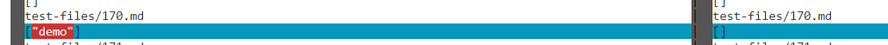

# Week 10 Lab Report 5

## First Test

* I picked test number 12 as my first comparsion. I used `vimdiff` as a tool
to find the different result for this one.
    * Here is the [link](https://github.com/nidhidhamnani/markdown-parser/blob/main/test-files/12.md) to the test file.

## Explaination for Test 1

* Here is the image of the first comparsion. The left side is my implementation
and the right side to the implementation from lab 9. Those are also the output
from both implementations.

    

* I noticed that the the implementation from lab 9 is the correct implementation because the test
does not contain any link, so it should return a empty array, `[]` and this is
what the implementation from lab returned.

    * The reason why my implementation is wrong is because my regax is only
    looking for there are something in between `[]` and `()`, since there are 
    `[]` and `()`, there are something in there then it will return it.

    

## Second Test
* I picked test number 170 as my second comparsion. I used `vimdiff` as a tool
to find the different result for this one.
    * Here is the [link](https://github.com/nidhidhamnani/markdown-parser/blob/main/test-files/170.md) to the test file.

## Explaination for Test 2

* Here is the image of the second comparsion. The left side is my implementation
and the right side to the implementation from lab 9. Those are also the output
from both implementations.

    

* The expected output for this test is an empty array, because this test file
contains java script code where there is no link involved. So the implementation
from lab 9 is correct.

    * The reason why my implementation is wrong is because my regax is only
    looking for there are something in between `[]` and `()`, since there are 
    `demo` is in between the `()` then it put `demo` in the array.
    